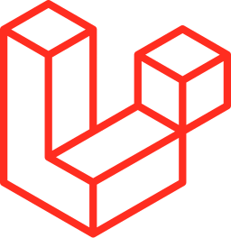

### 👋 Hi, I'm [Ron](https://upload.wikimedia.org/wikipedia/en/5/5e/Ron_Weasley_poster.jpg) [Hedwig](https://imagesvc.meredithcorp.io/v3/mm/image?url=https%3A%2F%2Fstatic.onecms.io%2Fwp-content%2Fuploads%2Fsites%2F6%2F2016%2F06%2Fharryhedwig_0.jpg&q=60)! 🦉

> aspiring to become a professional software engineer. I love Harry Potter and infuse magic into my works. 💫

#### 📞 Find me

>  Contact me for collaboration or discussion on magical coding via Facebook, Twitter(X), or email.
<samp>
     
    <a href="https://facebook.com/ronhedwigzape" target="_blank">Facebook</a>
    •
     
    <a href="mailto:ronzape@ronhedwigzape.com">Email</a>
    •
     
    <a href="https://twitter.com/ronhedwigzape" target="_blank">Twitter</a>
    •
    
    <a href="http://ronhedwigzape.com/" target="_blank">Hedwig's Site</a>
</samp>

#### 🛠 Tech Stack

<code></code>
<code></code>
<code></code>
<code></code>
<code></code>
<code></code>
<code></code>
<code></code>
<code></code>
<code></code>
<code></code>
<code></code>
<code></code>
<code></code>
<code></code>
<code></code>
<code></code>
<code></code>

####  Projects

 > I see software engineering as magic, creating amazing things from nothing. I spend my free time honing my magical skills.

 🗳 Crafts 

##### Successful Project/s

<!-- - [ronhedwigzape/portfolio](https://github.com/ronhedwigzape/portfolio) - The Harry Potter-Themed Developer Portfolio 🦉🧙‍♂️. -->
- [**ronhedwigzape/sportsfest-litmusda**](https://github.com/ronhedwigzape/sportsfest-litmusda) - Tabulation System for Sportsfest and LitMusDa at [@aclc-iriga](https://github.com/aclc-iriga).
- [**aclc-iriga/msr-mbm**](https://github.com/aclc-iriga/msr-mbm) - Tabulation System for Ms. San Ramon and Ms. Barakong Magayon (Iriga City).

##### Personal Project/s (Case Study)

- [**ronhedwigzape/vue-voice-gpt**](https://github.com/ronhedwigzape/vue-voice-gpt) - A Vue app that uses OpenAI's GPT-3/4 to generate text from voice input.
- [**ronhedwigzape/laravel-event-management**](https://github.com/ronhedwigzape/notes) - An event management API project with Laravel 10 (featuring php new syntax!).  
- [**ronhedwigzape/laravel-book-review**](https://github.com/ronhedwigzape/laravel-book-review) - A project for making book reviews.
- [**ronhedwigzape/vue-aliexpress-clone**](https://github.com/ronhedwigzape/vue-aliexpress-clone) - Nuxt Clone of Ali Express.

 

🎉 Feel free to [reach out](mailto:ronzape@ronhedwigzape.com), whether you’re a wizard or a muggle, for a chat about software engineering or Harry Potter. Thanks for visiting my GitHub profile!
